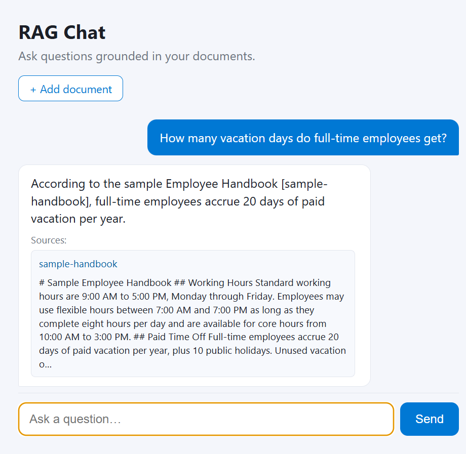

# RAG Chat

[](https://github.com/saidataharimatohoku-max/local-rag-chat/actions/workflows/tests.yml)

A minimal Retrieval-Augmented Generation (RAG) application: a Python FastAPI
backend, a static web frontend, and Azure infrastructure to host it. It answers
questions grounded in your own Markdown documents using Azure OpenAI for
embeddings/chat and Azure AI Search for retrieval. It also runs **fully local
and free** with [Ollama](https://ollama.com) — no cloud account required.

## Demo



The app retrieves the most relevant chunks from your documents and answers using
only that context, citing its sources — so it doesn't make things up. Answers
**stream in token-by-token**, and each cited source expands to show the exact
retrieved text. You can add documents straight from the browser with the
**+ Add document** button (Markdown, plain text, PDF, or Word), or drop files
into the `data/` folder and run the ingest command.

## Project structure

```
backend/      FastAPI app, RAG pipeline, ingestion, clients, config
frontend/     Static chat UI (HTML/CSS/JS)
data/         Source documents to index (.md, .txt, .pdf, .docx)
infra/        Azure Bicep templates (Search + Web App)
.github/      CI/CD workflow
```

## Prerequisites

- Python 3.11+
- **Local mode (free, no cloud):** [Ollama](https://ollama.com) installed
- **Azure mode (optional):** an Azure OpenAI resource (chat + embedding
  deployments) and an Azure AI Search service

The app auto-detects the provider: it uses Azure when Azure OpenAI is
configured, otherwise it runs fully locally with Ollama. Force it with the
`PROVIDER` environment variable (`local` or `azure`).

## Run locally with Ollama (no account needed)

1. Install Ollama from https://ollama.com, then pull the models:

   ```powershell
   ollama pull llama3.2:1b
   ollama pull nomic-embed-text
   ```

2. Create the virtual environment and install dependencies:

   ```powershell
   python -m venv .venv
   .venv\Scripts\python.exe -m pip install -r requirements.txt
   ```

3. Build the local index from `data/` and run the app:

   ```powershell
   .venv\Scripts\python.exe -m backend.ingest
   .venv\Scripts\python.exe -m uvicorn backend.app:app --reload
   ```

   Open http://localhost:8000 to chat. Retrieval uses a local NumPy vector
   store (`data/index.json`) instead of Azure AI Search.

## Azure setup

1. Create and activate a virtual environment, then install dependencies:

   ```powershell
   python -m venv .venv
   .venv\Scripts\Activate.ps1
   pip install -r requirements.txt
   ```

2. Copy `.env.example` to `.env`, set `PROVIDER=azure`, and fill in your Azure
   credentials. Load it into your shell (or use a tool such as `python-dotenv`).

3. Ingest the documents from `data/` into Azure AI Search:

   ```powershell
   python -m backend.ingest
   ```

4. Run the API and frontend:

   ```powershell
   python -m uvicorn backend.app:app --reload
   ```

   Open http://localhost:8000 to chat.

## How it works

1. `ingest.py` reads every supported document in `data/` (Markdown, plain
   text, PDF, and Word `.docx`), chunks it, embeds the chunks (Azure OpenAI
   or local Ollama), and stores them in Azure AI Search or a local index.
2. On a question, `rag.py` embeds the query, retrieves the top matching chunks,
   and asks the chat model to answer using only that context.
3. `app.py` serves the static frontend, a JSON `/api/chat` endpoint, and a
   streaming `/api/chat/stream` endpoint (Server-Sent Events) that the UI uses
   to render answers token-by-token.

## Tests

Unit and API tests run fully offline (the language model is mocked), so no
Ollama or Azure account is needed:

```powershell
.venv\Scripts\python.exe -m pip install -r requirements-dev.txt
.venv\Scripts\python.exe -m pytest
```

They cover text chunking, the on-disk vector store, multi-format document
reading, provider selection, and the API endpoints (chat, upload, validation).
The same suite runs on every push via GitHub Actions
(`.github/workflows/tests.yml`).

## Deploy to Azure

Provision infrastructure with the Bicep templates in `infra/`:

```powershell
az group create --name rag-rg --location eastus
az deployment group create `
  --resource-group rag-rg `
  --template-file infra/main.bicep `
  --parameters infra/main.parameters.json
```

Then set the Azure OpenAI app settings on the Web App and deploy the code
(the included GitHub Actions workflow in `.github/workflows/deploy.yml`
publishes on push to `main`).

## Configuration

All settings are read from environment variables; see `.env.example` for the
full list. If Azure OpenAI or Search is not configured, the API responds with a
helpful message instead of failing.
